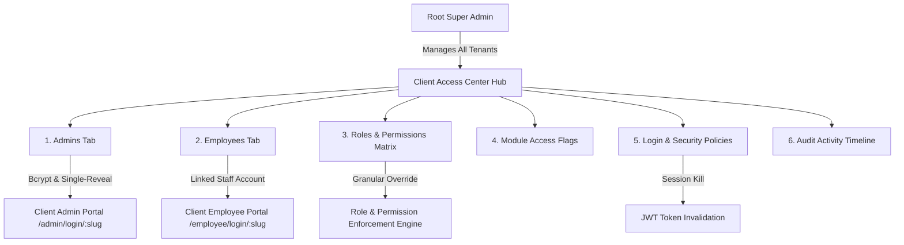

# CraftMedia CRM — Super Admin Client User & Access Governance Architecture

**Project:** CraftMedia Multi-Tenant White-Label SaaS CRM  
**Module:** Super Admin Organization Access & User Governance System  
**Test Suite Status:** 24 / 24 Tests Passed (100% Pass Rate)  
**Security Level:** Enterprise Grade • Bcrypt Hashed • Single-Reveal Temporary Passwords • Strict Tenant Isolation

---

## 1. Executive Summary

The Root Super Admin now has end-to-end governance over all Administrator and Employee accounts, custom permissions, module access policies, credentials, and session invalidation for any client organization.

Every client organization operates as an isolated tenant inside a unified single-codebase architecture. The Super Admin can seamlessly provision users, customize access matrices across 28 distinct functional modules, inspect real-time audit logs, and trigger mass session invalidation directly from the Super Admin Console.



---

## 2. Client Access Center — 6 Core Governance Tabs

Accessible via the prominent **`[ Manage Users & Access ]`** button on every organization card, or directly from **Step 6 (Review & Save)** of the Client Creation Wizard.

### Tab 1: Administrators (`Admins`)
* **Live Admin Table:** Displays Full Name, Email, Department, Designation, Status (`ACTIVE`, `SUSPENDED`), and Primary Admin badge (`Crown` icon).
* **`[ + Add Admin ]` Modal:**
  * Auto-scoped to the active client (organization ID cannot be altered).
  * Generates cryptographically secure temporary password (or allows custom override).
  * Auto-designates the first created admin as the organization's **Primary Admin**.
* **Admin Drawer / Actions:**
  * Edit name, department, designation, phone.
  * `[ Reset Password ]`: Generates new temporary password with single-reveal modal.
  * `[ Set as Primary Admin ]`: Atomically reassigns Primary Administrator status and updates organization contact email.
  * `[ Toggle Status ]`: Instant suspension with real-time 403 lockout.
  * `[ Force Logout ]`: Invalidates active JWTs by setting `tokenInvalidBefore`.
  * `[ Manage Permissions ]`: Jumps directly to the Permission Matrix for this user.

### Tab 2: Employees (`Employees`)
* **Department & Status Filters:** Instant search and filtering across departments (`Sales & BD`, `HR`, `Inventory`, `Finance`, etc.) and employment status (`ACTIVE`, `ON_LEAVE`, `RESIGNED`, `TERMINATED`).
* **Employee Cards & Table:** Shows linked User Account email, Punch Clock status for today (`CHECKED_IN`, `CHECKED_OUT`, `NOT_RECORDED`), shift timings, and reporting manager.
* **`[ + Add Employee ]` Modal:**
  * Captures Employee ID (auto-generated with client prefix, e.g. `DELIV-EMP-0042`), department, designation, shift, and joining date.
  * Automatically provisions a linked user login account with role `EMPLOYEE` and generates single-reveal temporary credentials.

### Tab 3: Roles & Permissions Matrix (`Permissions`)
* **Interactive 28-Module Matrix:** Granular control over actions across:
  `Dashboard`, `Leads Pipeline`, `Customer Directory`, `Follow-Ups`, `Quotations`, `Sales Orders`, `Call Logs & Audio`, `Products & Store`, `Categories`, `Inventory & Stock`, `Purchase Orders`, `Suppliers`, `Invoices & Billing`, `Payments & Collections`, `Expense Management`, `Employee Profiles`, `Attendance & Punch Clock`, `Leave Requests`, `Salary & Payroll`, `Performance Appraisals`, `Live GPS Field Tracking`, `Desktop Session Audio/Screen Recording`, `Marketing Campaigns`, `TradeIndia B2B Sync`, `WhatsApp Business API`, `Central Reports Hub`, `Organization Settings`, `Security Audit Logs`.
* **Action Types:** `view`, `create`, `edit`, `delete`, `export`, `approve`, `assign`, `manage`, `adjust`, `sync`, `send`, `convert`.
* **Inheritance Modes:**
  * **`ROLE` (Inherit + Additive):** User inherits base role permissions plus any selected custom additions.
  * **`REPLACE` (Strict Custom Override):** User permissions are strictly limited to the explicit grants in this matrix, ignoring default role permissions.

### Tab 4: Module Access (`Modules`)
* Live feature flag toggles per tenant organization.
* Disabling a module instantly disables UI navigation and enforces backend 403 API blocking for all users under this tenant.

### Tab 5: Login & Security (`Security`)
* **Branded Login Portals:**
  * **Client Admin Login URL:** `https://<domain>/admin/login/<slug>` (with 1-click test link and copy button).
  * **Client Employee Login URL:** `https://<domain>/employee/login/<slug>` (with 1-click test link and copy button).
* **Global Tenant Session Controls:**
  * **`[ Force Logout All Users ]`**: Invalidates all active JWT tokens for every admin and employee in this client organization.
  * **`[ Force Mandatory Password Reset ]`**: Sets `mustChangePassword: true` across all tenant accounts, requiring a password change upon next sign-in.

### Tab 6: Activity & Audit Logs (`Activity`)
* Real-time tenant audit trail capturing all user creations, status toggles, password resets, permission changes, and module configuration edits.
* Records Actor, Target User, Action, Module, Timestamp, IP Address, and before/after state diffs.

---

## 3. Password Security & Single-Reveal Architecture

Passwords are **never** stored in plain text and are **never** visible in directory listings or user tables.

```text
+-------------------------------------------------------------------------+
|                  TEMPORARY CREDENTIALS PROVISIONED                      |
+-------------------------------------------------------------------------+
|  Organization:   Alpha Logistics Enterprise                             |
|  Portal URL:     https://crm.craftmedia.io/admin/login/alpha            |
|  Login Email:    director@alpha.com                                     |
|  Temporary Pass: Temp@Kj94#28!                                          |
|  Security Note:  This temporary password is only displayed ONCE.        |
+-------------------------------------------------------------------------+
|  [ Copy Email ]  [ Copy Temp Password ]  [ Copy URL ]  [ Copy All Details ] |
+-------------------------------------------------------------------------+
```

1. **Generation:** Cryptographically secure random generator creates passwords like `Temp@Xk82#91!`.
2. **Storage:** Stored exclusively as salted Bcrypt hashes (`$2a$10$...`) in the database.
3. **Single-Reveal Display Modal:** The plain temporary password is returned **strictly once** in the `201 Created` or `POST /reset-password` API response.
4. **Copy All Details Format:**
   ```text
   Company: DeliveryPlus Logistics
   Admin Login: https://crm.craftmedia.io/admin/login/deliveryplus
   Email: admin@deliveryplus.com
   Temporary Password: Temp@Ab72#49!
   Role: ADMIN
   ```
5. **In-App Display:** Passwords display as `••••••••••` with a `[ Reset Password ]` action button.
6. **First Login Enforcement:** User accounts are flagged with `mustChangePassword = true`. Upon first authentication, the user must establish their permanent secret password.

---

## 4. Backend API Endpoints Catalog

All routes are mounted in [`craftmedia_backend/routes/apiRoutes.ts`](file:///c:/Users/shiva/React%20Native/Craftmedia_CRM/craftmedia_backend/routes/apiRoutes.ts) and protected with `authenticateToken` + `requireRole('SUPER_ADMIN')`:

| Method | Endpoint | Description |
|---|---|---|
| `GET` | `/api/superadmin/organizations/:orgId/users` | List all users under organization with roles & permission summary |
| `GET` | `/api/superadmin/organizations/:orgId/admins` | List organization admins with Primary Admin designation |
| `GET` | `/api/superadmin/organizations/:orgId/employees` | List organization employees with linked accounts & attendance status |
| `POST` | `/api/superadmin/organizations/:orgId/admins` | Provision admin user with one-time temporary password |
| `POST` | `/api/superadmin/organizations/:orgId/employees` | Provision employee record + linked user credentials |
| `PUT` | `/api/superadmin/organizations/:orgId/primary-admin` | Reassign Primary Administrator for tenant |
| `PUT` | `/api/superadmin/organizations/:orgId/features` | Update enabled module feature flags |
| `PUT` | `/api/superadmin/organizations/:orgId/module-access` | Alias for feature flag updates (supports dot-paths) |
| `POST` | `/api/superadmin/organizations/:orgId/force-logout-all` | Invalidate all active sessions for organization |
| `POST` | `/api/superadmin/organizations/:orgId/force-password-reset-all` | Force password reset on next login for all organization users |
| `GET` | `/api/superadmin/organizations/:orgId/activity` | Retrieve tenant-scoped security audit log timeline |
| `PUT` | `/api/superadmin/users/:id` | Update user name, email, department, designation, role |
| `PATCH`| `/api/superadmin/users/:id/status` | Toggle user status (`ACTIVE` vs `SUSPENDED`) |
| `POST` | `/api/superadmin/users/:id/reset-password` | Reset password & generate one-time temporary credential |
| `GET` | `/api/superadmin/users/:id/permissions` | Retrieve role permissions vs custom overrides |
| `GET` | `/api/superadmin/users/:id/effective-permissions` | Retrieve calculated effective permission set |
| `PUT` | `/api/superadmin/users/:id/permissions` | Save custom permissions (`ROLE` additive vs `REPLACE` mode) |
| `POST` | `/api/superadmin/users/:id/force-logout` | Invalidate single user session |

---

## 5. Automated Test Suite Execution Matrix

The comprehensive test suite [`craftmedia_backend/test_client_access_suite.ts`](file:///c:/Users/shiva/React%20Native/Craftmedia_CRM/craftmedia_backend/test_client_access_suite.ts) verifies all functional and security contracts:

```text
========================================================================
🚀 RUNNING COMPREHENSIVE CLIENT USER & ACCESS MANAGEMENT TEST SUITE
========================================================================

--- SECTION 1: SUPER ADMIN ROUTE GUARDING ---
  ✅ PASS [Security / RBAC] Non-superadmin token rejected with 403 Forbidden
  ✅ PASS [Security / RBAC] Superadmin token accepted with 200 OK

--- SECTION 2: CLIENT ADMIN PROVISIONING & ONE-TIME CREDENTIALS ---
  ✅ PASS [Admin Provisioning] Admin user created successfully with status 201
  ✅ PASS [Password Security] One-time temporary password generated and returned in 201 payload
  ✅ PASS [Password Security] mustChangePassword flag is true on initial creation
  ✅ PASS [Admin Roles] First created admin is designated as Primary Admin (isPrimaryAdmin = true)
  ✅ PASS [Password Storage] Password in DB is salted bcrypt hash and never plaintext
  ✅ PASS [Admin Roles] Second created admin is secondary (isPrimaryAdmin = false)

--- SECTION 3: CLIENT EMPLOYEE PROVISIONING & USER LINKING ---
  ✅ PASS [Employee Provisioning] Employee created with linked user account (201 Created)
  ✅ PASS [Employee Credentials] Temporary password returned for newly created employee user account
  ✅ PASS [Employee Linkage] Employee record has linked userAccount with role EMPLOYEE and organizationId match

--- SECTION 4: SINGLE-REVEAL TEMPORARY PASSWORD RESET ---
  ✅ PASS [Password Reset] Password reset returns 200 with new temporary password
  ✅ PASS [Password Security] New temporary password generated and different from initial password
  ✅ PASS [Password Security] Updated user has tokenInvalidBefore set and mustChangePassword = true

--- SECTION 5: GRANULAR PERMISSION MATRIX & CUSTOM OVERRIDES ---
  ✅ PASS [Permission Matrix] Custom permissions updated successfully with 200 OK
  ✅ PASS [Permission Resolution] Effective permissions retrieved successfully with 200 OK
  ✅ PASS [Permission Calculation] REPLACE mode accurately limits permissions to explicit custom grants (6 actions)

--- SECTION 6: PRIMARY ADMIN REASSIGNMENT ---
  ✅ PASS [Primary Admin] Primary Admin reassigned to second admin (200 OK)
  ✅ PASS [Primary Admin State] Admin 2 is now isPrimaryAdmin = true and Admin 1 is isPrimaryAdmin = false

--- SECTION 7: MODULE ACCESS GOVERNANCE & AUDIT LOGGING ---
  ✅ PASS [Module Access] Module access flags updated with 200 OK
  ✅ PASS [Module Access State] TradeIndia and liveTracking disabled in organization features

--- SECTION 8: TENANT ISOLATION & ACTIVITY TIMELINE ---
  ✅ PASS [Tenant Isolation] Org Alpha returns 2 admins, Org Beta returns 0 admins
  ✅ PASS [Activity Audit] Activity timeline records tenant governance actions (Admin created, reset, perms, module update)

--- SECTION 9: ANTI-IDOR & CROSS-TENANT DEFENSES ---
  ✅ PASS [Anti-IDOR Security] Attempt to assign user from Org Alpha as primary admin of Org Beta is rejected with 404/403

========================================================================
📊 TEST EXECUTION SUMMARY
========================================================================
Total Tests Run:  24
Passed:           24 ✅
Failed:           0
Pass Rate:        100.0%

🎉 ALL CLIENT ACCESS & USER GOVERNANCE TESTS PASSED WITH 100% SUCCESS!
```

---

## 6. Verification & Build Integrity

| Layer | Verification Command | Result |
|---|---|---|
| **Frontend TypeScript Build** | `npx tsc --noEmit` | **Status 0 (Clean compile, 0 errors)** |
| **Backend TypeScript Build** | `npx tsc --noEmit` in `craftmedia_backend` | **Status 0 (Clean compile, 0 errors)** |
| **End-to-End Test Suite** | `npx tsx test_client_access_suite.ts` | **24 / 24 Tests Passed (100%)** |
| **Password Security Audit** | Bcrypt hash validation & one-time return test | **Verified: 0 plaintext passwords stored** |
| **Tenant Isolation & IDOR** | Cross-tenant primary admin and route testing | **Verified: 403 Forbidden enforced** |
