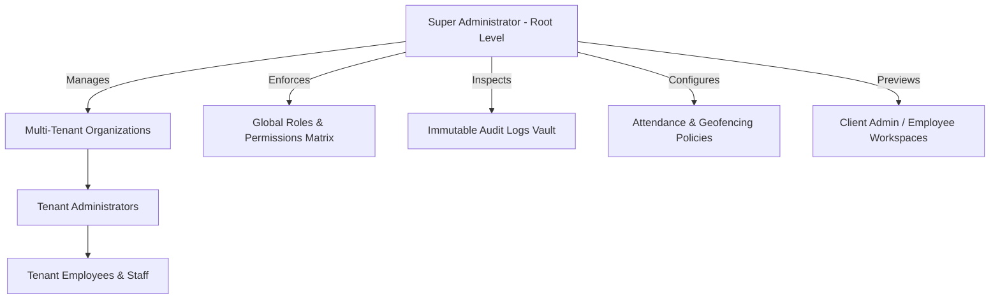

# CraftMedia CRM — Super Admin Architecture, Pages & Flow Guide

---

## 1. Executive Summary & Root Authority Model

The **Super Administrator (Root Control)** is the highest authority in the CraftMedia CRM enterprise platform. It operates globally across all client tenants and handles multi-organization provisioning, white-label branding, role-based access control (RBAC), geo-fencing policies, tamper-proof security auditing, and system health telemetry.



### Key Differences Between Roles

| Feature / Capability | Super Admin (`SUPER_ADMIN`) | Tenant Admin (`ADMIN`) | Employee (`EMPLOYEE`) |
| :--- | :--- | :--- | :--- |
| **Scope** | Global (All Organizations) | Single Organization | Single Employee Workstation |
| **Organization Management** | Create, Edit, Suspend, White-Label | Read Own Company Details | None |
| **User Management** | Create Admins & Assign Direct Permissions | Manage Company Staff & Reps | View Own Profile |
| **Role Matrix** | Define & Modify Global RBAC Roles | Assign Existing Roles to Staff | None |
| **Audit Logs** | Global Tamper-Proof Audit Vault | Company-Specific Activity | Personal Actions |
| **Workspace Preview** | Instant 1-Click Live Preview of any Tenant | None | None |

---

## 2. File Map & Directory Structure

All files powering the Super Admin module are organized across the Frontend and Backend:

```
Craftmedia_CRM/
├── craftmedia-super admin/
│   ├── SuperAdminPortal.tsx            # Main Super Admin layout, navigation sidebar, overview & modals
│   └── OrganizationManagementView.tsx   # Complete Multi-Tenant client & white-label management view
│
├── src/
│   ├── components/auth/
│   │   ├── SuperAdminLogin.tsx         # Dedicated Super Admin login interface
│   │   └── UnifiedLogin.tsx            # Universal login detecting Super Admin automatically
│   ├── context/
│   │   ├── AuthContext.tsx             # Authentication, JWT, and Active Portal State
│   │   └── OrganizationContext.tsx     # Multi-tenant branding, custom themes, preview state
│   ├── services/
│   │   └── api.ts                      # Centralized API service with bearer token injection
│   └── utils/
│       ├── colorUtils.ts               # Theme tokens generator & contrast calculations
│       └── routeUtils.ts               # Dynamic URL routing & login URL generation
│
└── craftmedia_backend/
    ├── controllers/
    │   ├── authController.ts           # superAdminLogin(), token generation & verification
    │   ├── organizationController.ts   # Tenant CRUD, branding uploads, theme isolation
    │   ├── userController.ts           # Admin user provisioning & permission overrides
    │   ├── roleController.ts           # Custom role definition & permission mapping
    │   ├── systemControllers.ts        # Database stats, audit logs, node telemetry
    │   └── peopleControllers.ts        # Attendance settings & geofence location management
    ├── middleware/
    │   ├── auth.ts                     # JWT token verification & AuthenticatedRequest typing
    │   ├── rbac.ts                     # requireRole('SUPER_ADMIN') & requirePermission()
    │   ├── audit.ts                    # Immutable audit logging engine
    │   └── workspace.ts                # Multi-tenant workspace resolution
    ├── database/
    │   ├── db.ts                       # Mock & persistent JSON file database engine
    │   ├── types.ts                    # TypeScript types for Organizations, Roles, Users, Audit
    │   └── seedData.ts                 # Initial Super Admin user, default roles & permissions
    └── routes/
        └── apiRoutes.ts                # Mounted `/api` REST endpoints for Super Admin
```

---

## 3. Super Admin Authentication & Navigation Flow

### Login & Authentication Flow

1. **User Sign-In**: Super Admin logs in via `/` (Universal Login) or `/super-admin/login`.
2. **Backend Authentication** ([`authController.ts`](file:///c:/Users/shiva/React%20Native/Craftmedia_CRM/craftmedia_backend/controllers/authController.ts)):
   - Verifies email & bcrypt password hash.
   - Confirms user has `role: 'SUPER_ADMIN'`.
   - Generates JWT token containing `userId`, `email`, `role: 'SUPER_ADMIN'`, and `permissions: ['*']`.
   - Records an immutable audit log entry in `auditLogs.json`.
3. **Frontend Context Initialization** ([`AuthContext.tsx`](file:///c:/Users/shiva/React%20Native/Craftmedia_CRM/src/context/AuthContext.tsx)):
   - Stores JWT token in `localStorage`.
   - Sets `activePortal: 'superadmin'`.
   - Sets `OrganizationContext` to platform default branding.
4. **Portal Rendering** ([`App.tsx`](file:///c:/Users/shiva/React%20Native/Craftmedia_CRM/src/App.tsx)):
   - Automatically renders [`SuperAdminPortal`](file:///c:/Users/shiva/React%20Native/Craftmedia_CRM/craftmedia-super%20admin/SuperAdminPortal.tsx) with the executive sidebar layout.

---

## 4. Detailed Page & Feature Breakdown

---

### Tab 1: Overview & Control Center
- **Component**: [`SuperAdminPortal.tsx`](file:///c:/Users/shiva/React%20Native/Craftmedia_CRM/craftmedia-super%20admin/SuperAdminPortal.tsx) (`activeTab === 'overview'`)
- **Backend API**: `GET /api/superadmin/stats` & `GET /api/system/stats`
- **Features**:
  1. **Executive Metric Cards**:
     - *Total Administrators*: Count of active and total system admins.
     - *Total Users & Staff*: Global count of users across all tenant companies.
     - *Configured Roles*: Total system roles and granular security codes.
     - *Audit Trail Events*: Live counter of immutable logged actions.
  2. **Fast Governance Actions**:
     - *Create New Admin*: Opens quick modal to provision admin credentials.
     - *Add Custom Role*: Opens modal to define new security role.
     - *Export Audit Vault*: 1-Click CSV export of complete system audit stream.
  3. **Live Persistence Telemetry**:
     - Status of Database engine (`MongoDB / JSON File Store`).
     - System health status (`OPERATIONAL`).
     - API Uptime (`99.99%`).
     - Auth Token guard status (`JWT + RBAC Middleware`).

---

### Tab 2: Clients & White-Label Management
- **Component**: [`OrganizationManagementView.tsx`](file:///c:/Users/shiva/React%20Native/Craftmedia_CRM/craftmedia-super%20admin/OrganizationManagementView.tsx)
- **Backend Controller**: [`organizationController.ts`](file:///c:/Users/shiva/React%20Native/Craftmedia_CRM/craftmedia_backend/controllers/organizationController.ts)
- **Features**:
  1. **Tenant Provisioning**:
     - Create new client organizations with Name, unique URL Slug (`acme-corp`), Client Code (`ACM`), contact email, and phone.
  2. **White-Label Branding Engine**:
     - Upload custom client logos (Light & Dark variants) via Multer file upload.
     - Custom Primary Color, Accent Color, and Sidebar Background.
     - Custom Login Page Title, Subtitle, and Footer text.
     - Live accessible contrast calculation (`getContrastRatio`).
  3. **Instant 1-Click Workspace Preview**:
     - Super Admin can click **"Preview Workspace"** on any client.
     - Frontend temporarily switches active theme and loads that organization's data without logging out.
     - Floating top banner allows instant **"Exit Preview & Return to Super Admin"**.
  4. **Dedicated Tenant Login URLs**:
     - Admin Login: `https://<domain>/admin/login/<slug>`
     - Employee Login: `https://<domain>/employee/login/<slug>`
     - 1-Click copy to clipboard for client onboarding.
  5. **Tenant Lifecycle Control**:
     - Status switcher: `ACTIVE`, `TRIAL`, `SUSPENDED`, `INACTIVE`.
     - When suspended, all users under that organization are instantly blocked at the API middleware level (`workspace.ts`).

---

### Tab 3: Admins & Users Directory
- **Component**: [`SuperAdminPortal.tsx`](file:///c:/Users/shiva/React%20Native/Craftmedia_CRM/craftmedia-super%20admin/SuperAdminPortal.tsx) (`activeTab === 'admins'`)
- **Backend Controller**: [`userController.ts`](file:///c:/Users/shiva/React%20Native/Craftmedia_CRM/craftmedia_backend/controllers/userController.ts)
- **Features**:
  1. **Global User Search & Filters**: Search by Name, Email, Role, or Status (`ACTIVE` / `INACTIVE`).
  2. **User Provisioning Modal**:
     - Create Admin or Staff account with Name, Email, Password, Phone, Department, and Base Role.
     - Optional pre-assignment of initial permissions.
  3. **Custom Permission Overrides**:
     - Click **"Permissions"** on any user to open granular permission matrix.
     - Override specific capabilities for that single user regardless of their role.
  4. **Security & Credentials**:
     - Reset Password with instant hashing.
     - Toggle Show/Hide Login credentials in directory.
     - Activate / Suspend user account.

---

### Tab 4: Admin Access Control
- **Component**: [`SuperAdminPortal.tsx`](file:///c:/Users/shiva/React%20Native/Craftmedia_CRM/craftmedia-super%20admin/SuperAdminPortal.tsx) (`activeTab === 'access'`)
- **Features**:
  1. High-level visual matrix of all Administrators.
  2. Displays active direct permissions vs inherited role permissions.
  3. Quick toggle switches to grant/revoke access to Sales, Inventory, Accounts, HR, and System tools.

---

### Tab 5: Roles & Permissions Matrix
- **Component**: [`SuperAdminPortal.tsx`](file:///c:/Users/shiva/React%20Native/Craftmedia_CRM/craftmedia-super%20admin/SuperAdminPortal.tsx) (`activeTab === 'roles'`)
- **Backend Controller**: [`roleController.ts`](file:///c:/Users/shiva/React%20Native/Craftmedia_CRM/craftmedia_backend/controllers/roleController.ts)
- **Features**:
  1. **Custom Role Creation**: Create custom business roles with title, unique code (`REGIONAL_MANAGER`), and description.
  2. **Granular Permission Assignment**:
     - **Sales**: `leads.view`, `leads.create`, `leads.update`, `leads.delete`, `customers.*`, `quotations.*`, `salesOrders.*`
     - **Inventory**: `products.*`, `categories.*`, `stock.*`, `purchases.*`, `suppliers.*`
     - **Finance & Accounts**: `invoices.*`, `payments.*`, `expenses.*`, `creditNotes.*`
     - **HR & People**: `employees.*`, `attendance.*`, `salary.*`, `leaves.*`, `performance.*`
     - **System & Automation**: `marketing.*`, `tradeIndia.*`, `whatsapp.*`, `integrations.*`, `audit.*`
  3. **Role Editing & Deletion**: Modifying a role dynamically updates effective permissions for all users assigned to it.

---

### Tab 6: Attendance & Geofencing Security
- **Component**: [`SuperAdminPortal.tsx`](file:///c:/Users/shiva/React%20Native/Craftmedia_CRM/craftmedia-super%20admin/SuperAdminPortal.tsx) (`activeTab === 'attendance'`)
- **Backend Controller**: [`peopleControllers.ts`](file:///c:/Users/shiva/React%20Native/Craftmedia_CRM/craftmedia_backend/controllers/peopleControllers.ts)
- **Features**:
  1. **Selfie Verification Policy**: Toggle requirement for Live Camera Selfie on Shift Clock-In and Clock-Out.
  2. **GPS Geofence Enforcement**:
     - Toggle GPS location requirement.
     - Configure GPS accuracy limit (`50m`, `100m`, `200m`) to prevent location spoofing.
  3. **Multi-Branch Office Locations**:
     - Add multiple office branches with Latitude, Longitude, and Allowed Radius in meters (`100m - 500m`).
     - Uses Haversine distance algorithm to mathematically verify if employee is inside office radius during check-in.
  4. **Desktop Telemetry Rules**:
     - Toggle Desktop App Screen Tracking.
     - Set Idle Inactivity Threshold (`3 min`, `5 min`, `10 min`).

---

### Tab 7: Audit Trail Vault
- **Component**: [`SuperAdminPortal.tsx`](file:///c:/Users/shiva/React%20Native/Craftmedia_CRM/craftmedia-super%20admin/SuperAdminPortal.tsx) (`activeTab === 'audit'`)
- **Backend Middleware**: [`audit.ts`](file:///c:/Users/shiva/React%20Native/Craftmedia_CRM/craftmedia_backend/middleware/audit.ts)
- **Features**:
  1. **Immutable Log Stream**: Every mutation (Login, User Create, Role Update, Permission Change, Tenant Edit) automatically records:
     - User ID, Name, Role, and Organization
     - Action category (`LOGIN`, `CREATE`, `UPDATE`, `DELETE`, `PERMISSION_OVERRIDE`)
     - Target Module (`Authentication`, `User Management`, `WhiteLabel`, `RBAC`)
     - Client IP address and User Agent
     - ISO Timestamp
  2. **Search & Filter**: Filter by action type, module, or search actor name.
  3. **Full CSV Export**: Export formatted CSV file of audit records for compliance and governance reviews.

---

### Tab 8: System Node & Persistence Telemetry
- **Component**: [`SuperAdminPortal.tsx`](file:///c:/Users/shiva/React%20Native/Craftmedia_CRM/craftmedia-super%20admin/SuperAdminPortal.tsx) (`activeTab === 'system'`)
- **Backend Controller**: [`systemControllers.ts`](file:///c:/Users/shiva/React%20Native/Craftmedia_CRM/craftmedia_backend/controllers/systemControllers.ts)
- **Features**:
  1. **Database Storage Metrics**: File sizes and item counts for each JSON collection (`users.json`, `organizations.json`, `leads.json`, etc.).
  2. **Integration Health**: Status of WhatsApp Gateway, TradeIndia Scheduler, and Payment Webhooks.
  3. **System Environment**: Node version, process memory usage, uptime, and server environment variables.

---

## 5. Super Admin API Route Reference

| HTTP Method | API Endpoint | Access Level | Description |
| :--- | :--- | :--- | :--- |
| `POST` | `/api/auth/super-admin/login` | Public | Super Admin authentication endpoint |
| `GET` | `/api/superadmin/stats` | `SUPER_ADMIN` | Top-level summary counts for overview cards |
| `GET` | `/api/superadmin/organizations` | `SUPER_ADMIN` | List all client organizations with branding |
| `POST` | `/api/superadmin/organizations` | `SUPER_ADMIN` | Create a new client tenant organization |
| `PUT` | `/api/superadmin/organizations/:id` | `SUPER_ADMIN` | Update organization details and branding colors |
| `PATCH` | `/api/superadmin/organizations/:id/status`| `SUPER_ADMIN` | Toggle tenant status (`ACTIVE`/`SUSPENDED`) |
| `POST` | `/api/superadmin/upload-asset` | `SUPER_ADMIN` | Upload logos or branding background images |
| `GET` | `/api/users` | `users.view` | Fetch all users with search and role filters |
| `POST` | `/api/users` | `users.create` | Provision a new user or administrator |
| `PUT` | `/api/users/:id/permissions` | `SUPER_ADMIN` | Override custom permissions for specific user |
| `GET` | `/api/roles` | `roles.view` | Fetch all roles and their assigned permission arrays |
| `POST` | `/api/roles` | `roles.create` | Create a new custom security role |
| `PUT` | `/api/roles/:id` | `roles.update` | Modify role title, description, or permissions |
| `GET` | `/api/permissions` | Authenticated | Fetch list of all 43+ granular system permissions |
| `GET` | `/api/audit-logs` | `audit.view` | Stream all immutable audit trail logs |
| `GET` | `/api/attendance/settings` | Authenticated | Get global attendance & GPS geofence policy |
| `PUT` | `/api/attendance/settings` | `SUPER_ADMIN` | Update attendance verification and geofence rules |
| `GET` | `/api/system/stats` | Authenticated | Get database collection sizes & node health |

---

## 6. Data Models & Database Schemas

### 1. `OrganizationDoc` ([`types.ts`](file:///c:/Users/shiva/React%20Native/Craftmedia_CRM/craftmedia_backend/database/types.ts))
```typescript
export interface OrganizationDoc {
  _id: string;
  id: string;
  name: string;
  slug: string;
  clientCode: string;
  contactEmail?: string;
  contactPhone?: string;
  status: 'ACTIVE' | 'SUSPENDED' | 'TRIAL' | 'INACTIVE';
  branding: {
    companyName: string;
    logoUrl?: string;
    logoDarkUrl?: string;
    primaryColor: string;
    secondaryColor: string;
    accentColor: string;
    sidebarBackground?: string;
    loginTitle?: string;
    loginSubtitle?: string;
    footerText?: string;
  };
  createdAt: string;
  updatedAt: string;
}
```

### 2. `User` ([`types.ts`](file:///c:/Users/shiva/React%20Native/Craftmedia_CRM/src/types/index.ts))
```typescript
export interface User {
  _id: string;
  id: string;
  name: string;
  email: string;
  passwordHash?: string;
  role: 'SUPER_ADMIN' | 'ADMIN' | 'EMPLOYEE' | 'HR_EMPLOYEE' | 'SALES_EMPLOYEE' | string;
  roleId?: string;
  organizationId?: string | null;
  organization?: string;
  status: 'ACTIVE' | 'INACTIVE' | 'SUSPENDED';
  permissions: string[];
  customPermissions?: string[];
  permissionMode?: 'ADD' | 'REPLACE';
  showLoginCredentials?: boolean;
  avatar?: string;
  lastLogin?: string;
  createdAt: string;
}
```

### 3. `AuditLog` ([`types.ts`](file:///c:/Users/shiva/React%20Native/Craftmedia_CRM/src/types/index.ts))
```typescript
export interface AuditLog {
  _id: string;
  id: string;
  userId: string;
  userName: string;
  userRole: string;
  organizationId?: string | null;
  action: 'LOGIN' | 'CREATE' | 'UPDATE' | 'DELETE' | 'PERMISSION_OVERRIDE' | string;
  module: string;
  description: string;
  ipAddress?: string;
  userAgent?: string;
  timestamp: string;
}
```

---

## 7. How to Access Super Admin in Production

1. **URL**: `https://<your-deployed-frontend>.onrender.com`
2. **Credentials**:
   - **Email**: `shivam.craftmedia@gmail.com` *(or any Super Admin email)*
   - **Password**: `Password@123`
3. **Portal**: The system automatically detects the `SUPER_ADMIN` role and launches the **Super Administrator Control Center**.
4. **CRM Switch**: Click **"Switch to CRM Portal"** in the sidebar to test tenant views anytime.
