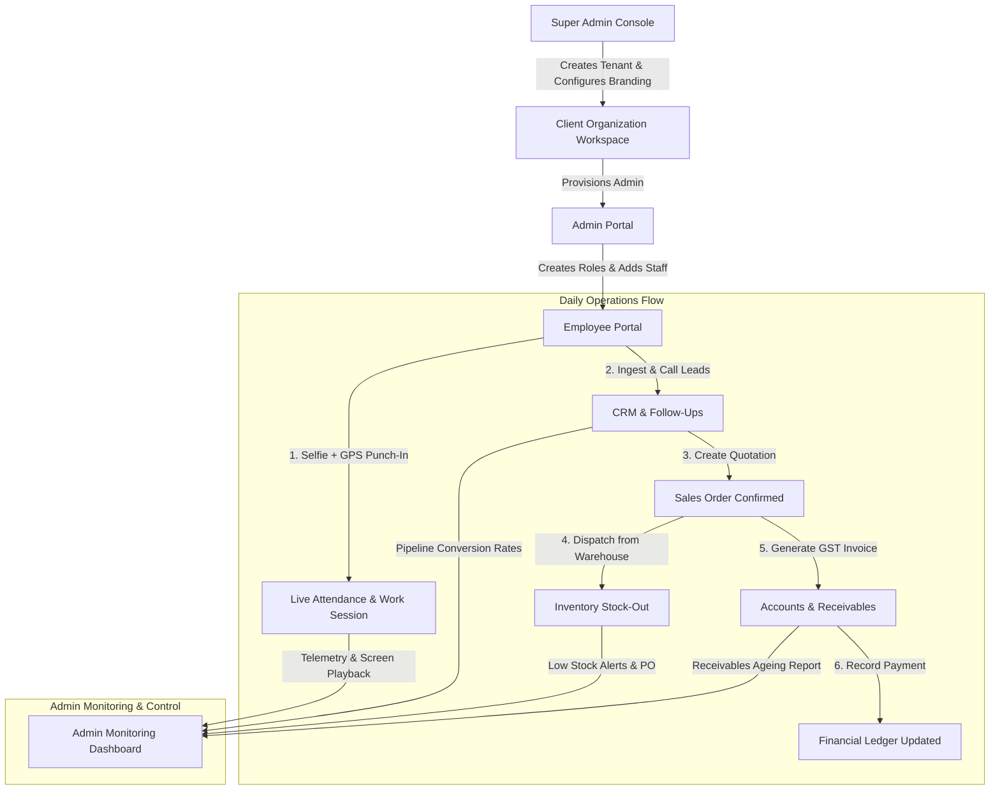

# 360CRM & CraftNova Enterprise Suite — Complete Features & Workflow Guide

> **Unified Multi-Tenant CRM, Inventory, Accounts, Field Telemetry & Employee Work Session Intelligence Platform**

---

## 📑 Table of Contents
1. [Platform Architecture Overview](#1-platform-architecture-overview)
2. [Admin Portal — Features & Complete Workflow](#2-admin-portal--features--complete-workflow)
   - [2.1 Dashboard & Business Intelligence](#21-dashboard--business-intelligence)
   - [2.2 Sales & CRM Management](#22-sales--crm-management)
   - [2.3 Inventory & Warehouse Management](#23-inventory--warehouse-management)
   - [2.4 Accounts & Financial Suite](#24-accounts--financial-suite)
   - [2.5 HR, Attendance & Payroll](#25-hr-attendance--payroll)
   - [2.6 Live Employee Telemetry & Geofencing](#26-live-employee-telemetry--geofencing)
   - [2.7 Employee Work Session & Screen Recording Studio](#27-employee-work-session--screen-recording-studio)
   - [2.8 Marketing & Lead Ingestion](#28-marketing--lead-ingestion)
   - [2.9 User Roles, Permissions & Security](#29-user-roles-permissions--security)
3. [Employee Portal — Features & Complete Workflow](#3-employee-portal--features--complete-workflow)
   - [3.1 Shift Punch-In / Punch-Out (Selfie + Geo-location)](#31-shift-punch-in--punch-out-selfie--geo-location)
   - [3.2 Screen Recording & Work Session Tracking](#32-screen-recording--work-session-tracking)
   - [3.3 Lead Management & Direct Calling](#33-lead-management--direct-calling)
   - [3.4 WhatsApp & Follow-Up Automation](#34-whatsapp--follow-up-automation)
   - [3.5 Quotations & Order Creation](#35-quotations--order-creation)
   - [3.6 Self-Service HR (Leaves, Salary Slip, Performance)](#36-self-service-hr-leaves-salary-slip-performance)
4. [Super Admin Console — Platform Management](#4-super-admin-console--platform-management)
5. [End-to-End Business Flow Diagram](#5-end-to-end-business-flow-diagram)

---

## 1. Platform Architecture Overview

The software is built on a **High-Security Multi-Tenant Architecture**:
- **White-Label Branding**: Each client organization gets their dedicated branding (Logo, Brand Colors, Custom Favicon, Dedicated Login URL e.g. `/?org=craft-media-hub`).
- **Strict Data Isolation**: No organization can ever access or view another organization's leads, accounts, inventory, or employees.
- **Role-Based Access Control (RBAC)**: Granular permissions per role (`SUPER_ADMIN`, `ADMIN`, `SALES_EMPLOYEE`, `STORE_EMPLOYEE`, `ACCOUNTANT`, `HR_EMPLOYEE`, `EMPLOYEE`).
- **Real-Time Telemetry & Media Streaming**: Continuous desktop and mobile activity tracking with chunks upload queue.

---

## 2. Admin Portal — Features & Complete Workflow

### 2.1 Dashboard & Business Intelligence
- **Real-Time KPI Cards**: Total Leads, Active Customers, Unpaid Invoices, Live Warehouse Stock Valuation, Monthly Purchase Orders, and Pending Receivables.
- **Interactive Sales Funnel**: Visual pipeline showing conversion from *New Lead &rarr; Contacted &rarr; Quotation Sent &rarr; Won/Converted*.
- **Quick Action Triggers**: 1-click shortcuts to Add Lead, Generate GST Invoice, Create Quotation, or Punch Shift.

---

### 2.2 Sales & CRM Management
```
[Lead Ingestion] ──► [Lead Assignment] ──► [Follow-Up / Call] ──► [Quotation] ──► [Sales Order] ──► [Customer]
```

1. **Leads Management**:
   - Filter by status (`NEW`, `CONTACTED`, `QUALIFIED`, `PROPOSAL_SENT`, `NEGOTIATION`, `WON`, `LOST`).
   - Filter by Source (`TradeIndia`, `IndiaMART`, `Website`, `Cold Call`, `WhatsApp`, `Referral`).
   - Assign leads to specific sales executives with automated notifications.
   - Bulk Excel/CSV Import & Export.
2. **Customer Master Directory**:
   - Complete 360-degree customer profile with billing address, GSTIN, credit limit, and transaction history.
3. **Quotations (Estimates)**:
   - Dynamic multi-item pricing with automatic CGST/SGST/IGST tax calculation.
   - 1-Click Convert: Turn approved quotations into confirmed **Sales Orders** or **Invoices**.
4. **Sales Orders**:
   - Order fulfillment tracking: *Draft &rarr; Confirmed &rarr; Processing &rarr; Dispatched &rarr; Delivered*.
5. **Follow-Ups & Call Logs**:
   - Integrated calendar with Overdue, Today, and Upcoming follow-up reminders.
   - Direct WhatsApp message triggers with pre-configured dynamic templates.

---

### 2.3 Inventory & Warehouse Management
1. **Product Master Catalog**:
   - SKU, Barcode, HSN Code, Category, Unit of Measurement (Pcs, Kg, Mtr, Box), Purchase Price, Selling Price, Tax %.
   - Minimum and Maximum Stock thresholds with auto low-stock alerts.
2. **Multi-Warehouse Stock Control**:
   - Manage multiple warehouses/plants (e.g. *Main Plant, Regional Hub, North Depot*).
   - Stock Transfer between warehouses with dispatch and receipt acknowledgment.
3. **Stock In & Stock Out (Transactions)**:
   - Material Inward (Purchase Receipt, Return, Adjustment).
   - Material Outward (Sales Dispatch, Sample, Damage).
4. **Suppliers & Purchase Management**:
   - Supplier master directory with payment terms and balance ledger.
   - Purchase Orders (PO) with automated warehouse stock updating upon receipt.

---

### 2.4 Accounts & Financial Suite
1. **GST Invoices**:
   - Professional GST tax invoice generation with company logo, digital signature, HSN summary, and bank details.
   - Status tracking: `PAID`, `PARTIALLY_PAID`, `UNPAID`, `OVERDUE`.
2. **Payment Receipts & Allocations**:
   - Record customer payment receipts via UPI, NEFT/RTGS, Cheque, or Cash with auto-reconciliation.
3. **Accounts Receivables (Outstandings)**:
   - Ageing report (0-30 days, 31-60 days, 61-90 days, 90+ days overdue) with 1-click WhatsApp payment reminders.
4. **Accounts Payables (Supplier dues)**:
   - Track pending supplier bills and upcoming payment schedules.
5. **Expense Management**:
   - Track operational expenses categorized by Rent, Utilities, Travel, Logistics, Marketing with receipt uploads.
6. **Credit Notes**:
   - Issue credit notes for sales returns with automated invoice balance reduction.

---

### 2.5 HR, Attendance & Payroll
1. **Employee Master Directory**:
   - Profile, Department, Designation, Joining Date, Emergency Contact, Salary Structure, Bank Details.
2. **Attendance Management**:
   - Daily logs with Check-In Time, Check-Out Time, Working Hours, Selfie Verification, GPS Location, and Status (`PRESENT`, `LATE`, `HALF_DAY`, `ON_LEAVE`, `ABSENT`).
3. **Salary & Payroll Processing**:
   - Automated monthly salary calculation based on present days, overtime, deductions, and bonuses.
   - Downloadable PDF Payslips for employees.
4. **Leave Management**:
   - Employee leave requests with Admin approval / rejection workflow.

---

### 2.6 Live Employee Telemetry & Geofencing
1. **Real-Time GPS Map**:
   - Live location tracking of field sales executives on an interactive map.
   - Battery level, network status, speed, and last ping timestamp.
2. **Historical Route Playback**:
   - Playback the entire route traveled by an employee during their workday with stop duration markers.
3. **Geofencing & Client Site Tracking**:
   - Define circular or polygon geofences around client offices/warehouses.
   - Auto alerts on Geofence Entry, Exit, and unauthorized site deviation.

---

### 2.7 Employee Work Session & Screen Recording Studio
1. **Continuous Work Session Recording**:
   - Real-time screen recording during active punch-in shifts.
   - Resilient chunk upload queue (uploads even in low-bandwidth conditions).
2. **Advanced Multi-Tab Work Session Player**:
   - **Overview Tab**: Session duration, punch time, GPS start/end, total idle time.
   - **Timeline Tab**: CRM activity markers (Lead opened, WhatsApp sent, Call logged) synced directly with video timestamp.
   - **Recordings Tab**: Continuous video player with speed controls (`0.5x`, `1.0x`, `1.5x`, `2.0x`) and chapter jumping.
   - **Health Tab**: CPU/Memory utilization and background desktop telemetry.
   - **Route Tab**: Synchronized GPS route taken during the recording.

---

### 2.8 Marketing & Lead Ingestion
1. **TradeIndia & IndiaMART Direct Webhook API**:
   - Auto-ingests trade portal buyer inquiries straight into CRM leads in real time.
2. **Campaign Manager**:
   - Track marketing campaigns across Google Ads, Meta, Email, and SMS with ROI analytics.
3. **WhatsApp Business Outreach**:
   - Send template messages, quotations, and brochures directly to leads.

---

### 2.9 User Roles, Permissions & Security
- **Role Creator**: Customize permissions for each role.
- **Permission Matrix**: 70+ granular permission toggles spanning Leads, Sales, Inventory, Accounts, HR, and System Settings.
- **Session Security**: Force logout rogue users or all organization users simultaneously.

---

## 3. Employee Portal — Features & Complete Workflow

The **Employee Workstation** is a focused, distraction-free environment tailored for field sales, store heads, accountants, and HR staff.

```
[Employee Login] ──► [Selfie + GPS Punch-In] ──► [Work Session Starts] ──► [Manage Leads & Calls] ──► [Punch-Out & Upload]
```

### 3.1 Shift Punch-In / Punch-Out (Selfie + Geo-location)
1. **Secure Camera Selfie**: Employee captures a live selfie directly from the browser/mobile app (no gallery uploads permitted).
2. **High-Accuracy GPS Locking**: Coordinates and address are validated against company geofences.
3. **Live Shift Timer**: Real-time counter showing active shift hours and break status.
4. **Tea / Lunch Break Toggle**: 1-click pause/resume for break tracking.

---

### 3.2 Screen Recording & Work Session Tracking
- When screen recording policy is enabled for the organization:
  1. Prompt for consent and screen capture stream upon Punch-In.
  2. Background desktop activity tracking (active windows, productive applications).
  3. Safe offline caching in IndexedDB if internet disconnects, auto-resuming upload on reconnect.

---

### 3.3 Lead Management & Direct Calling
1. **My Assigned Leads**:
   - Quick search by name, phone, company, or city.
   - Pipeline status chips (`NEW`, `IN_PROGRESS`, `HOT`, `FOLLOW_UP`, `CONVERTED`).
2. **Direct Click-to-Call**:
   - Initiate calls directly with automated call duration logging and outcome tagging (*Answered, Busy, Switched Off, Interested, Not Interested*).

---

### 3.4 WhatsApp & Follow-Up Automation
1. **1-Click WhatsApp Trigger**:
   - Opens pre-formatted WhatsApp chat with lead's phone number without saving to contact book.
2. **Follow-Up Reminders**:
   - Schedule future follow-up dates and notes.
   - Overdue follow-up alerts appear at the top of the workstation.

---

### 3.5 Quotations & Order Creation
- Field executives can prepare instant quotations on the client's premises:
  - Select items from the live product catalogue.
  - Calculate GST and discounts instantly.
  - Share PDF quotation via WhatsApp or Email.

---

### 3.6 Self-Service HR (Leaves, Salary Slip, Performance)
1. **Attendance History**: View self monthly calendar, punch timings, and approved attendance regularizations.
2. **Salary Slips**: View and download self payslips.
3. **Leave Applications**: Apply for Sick, Casual, or Paid leaves and track approval status in real time.
4. **Personal Performance**: Track individual targets, closed leads, and generated revenue.

---

## 4. Super Admin Console — Platform Management

For Platform Owners (`shivamshishodia5541@gmail.com`):

1. **Client Organization Provisioning**:
   - Create new companies with 1 click (e.g. *Craft Media Hub, DeliveryPlus, Shiv Shakti*).
   - Set Client Code, slug, custom domain, and primary contact email.
2. **Custom White-Label Branding Engine**:
   - Set primary/accent brand colors, upload custom company logo & dark logo, customize login portal titles and background.
3. **Feature Matrix Allocation**:
   - Enable/disable modules per client (CRM, Accounts, Inventory, Telemetry, Work Session Recording, TradeIndia Integration).
4. **Subscription & Resource Limits**:
   - Set Max Employees (e.g. 50, 100, Unlimited), Max Admins, Monthly Lead limits, and Cloud Storage quota.
5. **Security & Session Control**:
   - View all active users across all tenants.
   - Reset any admin password with auto-generated secure temporary tokens.
   - Designate / Reassign **Primary Administrator** with 1 click.
   - Remote **Force Logout** for specific users or an entire client workspace.

---

## 5. End-to-End Business Flow Diagram



---

## 6. Access Credentials Summary

| Role | Portal URL | Default / Configured Email | Password |
| :--- | :--- | :--- | :--- |
| **Super Admin Platform** | `/login` or `/?portal=super_admin` | `shivamshishodia5541@gmail.com` | `shivamshishodia5541@gmail.com` |
| **Craft Media Hub Admin** | `/?org=craft-media-hub` | `shivamadmin@gmail.com` | `admin123` |
| **Alternative Admin** | `/?org=craft-media-hub` | `admincraft@gmail.com` | `admin123` |
| **Employee Workstation** | `/?org=craft-media-hub&portal=employee` | Employee Email / ID | Configured Password |

---
*Generated & maintained by 360CRM Enterprise Intelligence Suite.*
